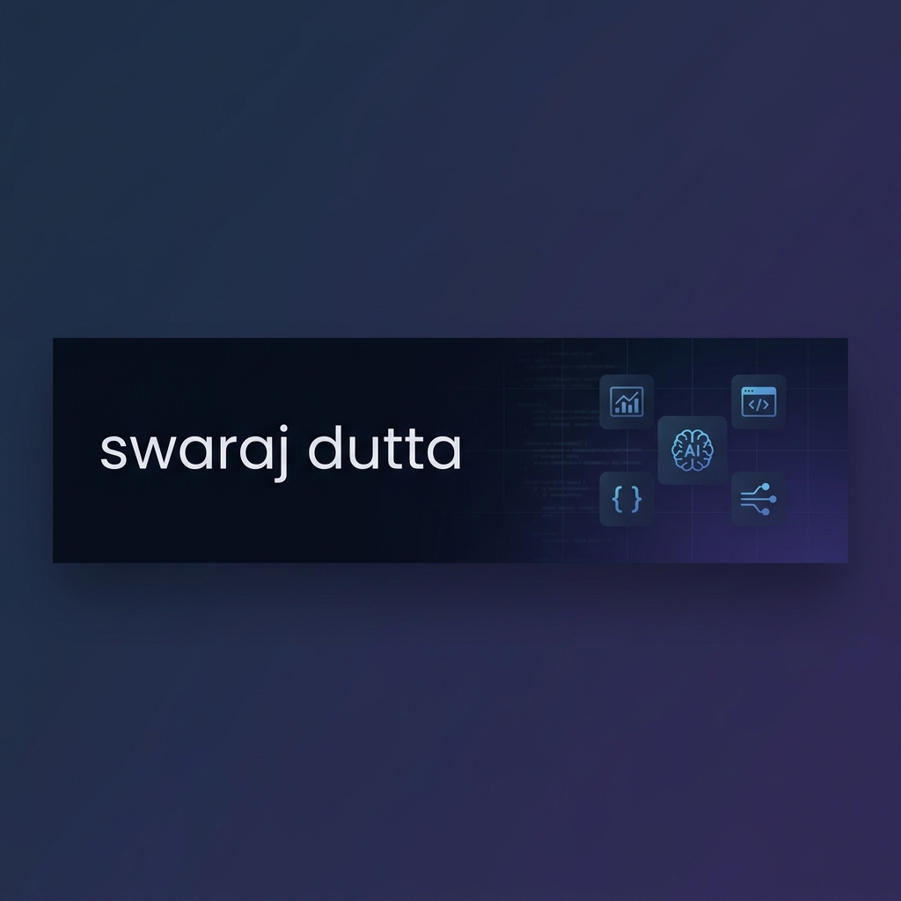

<div align="center">

</div>

### hey, i'm swaraj 👋

i'm a cs undergrad at IEM Kolkata who builds things that sit between **code and business logic** — report automation pipelines, algorithmic trading systems, and research tools for satellite imagery.

i think the best software doesn't just work — it changes how people make decisions.

---

#### 🔨 stuff i've built

| project | what it does | stack |
|---------|-------------|-------|
| [**dokucreator**](https://github.com/swarajduttacv/dokucreator) | ai-powered data visualization & report automation platform. paste data, get charts, slides, and reports — instantly. | react · vite · gemini api · recharts |
| [**dokucreator-backend**](https://github.com/swarajduttacv/dokucreator-backend) | auth, storage, and api layer powering dokucreator. handles user sessions, saved content, and data persistence. | node.js · express · mongodb |
| [**zero**](https://github.com/swarajduttacv/zero) | algorithmic trading system for indian equities. real-time sentiment analysis + automated execution via kite api. | typescript · kite api · llm integration |
| [**documind**](https://github.com/swarajduttacv/dm) | personal ai document assistant — upload ids, certificates, notes, then chat with your docs and auto-fill forms via gemini vision. | react · vite · gemini 2.5 flash |
| [**aria**](https://github.com/swarajduttacv/ARIA-ai-talent-acquisition-assistant) | ai talent acquisition assistant — parses resumes, ranks candidates, runs chatbot assessments. | javascript · nlp · rest apis |
| [**edu-agent-pipeline**](https://github.com/swarajduttacv/edu-agent-pipeline) | multi-agent ai pipeline for educational content processing and knowledge extraction. | python · langchain · agents |
| [**ai-pitch-reviewer**](https://github.com/swarajduttacv/pitch) | ai-powered pitch deck analyzer — scores clarity, storytelling, and investor-readiness. | coming soon |

---

#### 📡 research

**spectral unmixing & mangrove species classification via satellite imagery**  
*bhitarkanika & andaman islands · sentinel-1/2 · under review, 2026*

used sub-pixel spectral unmixing to classify mangrove species — pushed accuracy ~35% beyond standard pixel methods across 100+ km² of coastal habitat.

---

#### 🧰 what i work with

```
languages    python · javascript · typescript · java · sql
ai/ml        gemini api · openai api · langchain · llm pipelines · nlp
frontend     react · vite · recharts · html/css · figma
backend      node.js · express · fastapi · rest apis
databases    mongodb · mysql · postgresql
tools        git · vercel · render · github actions
domains      fintech · remote sensing · data viz · report automation
```

---

#### 📊 some numbers

- **1,000+** row datasets processed automatically by dokucreator
- **40%** reduction in manual reporting effort
- **<4s** trade execution latency on the algo trading bot
- **10+** equity instruments monitored in real-time
- **50+** developers in the GDG community i lead on campus
- **150+** people at my TEDx talk
- **94th** percentile GMAT Verbal (yes, in 3rd year of engineering)

---

#### 🎯 what's next

targeting **business analyst · data analyst · product management** roles for campus placements (2027).  
long-term: MBA → tech leadership at the intersection of engineering and business.

i respond to messages — [swarajdutta03@gmail.com](mailto:swarajdutta03@gmail.com) · [linkedin](https://www.linkedin.com/in/swaraj-dutta-712b1128a/)

---

<details>
<summary>📈 github stats</summary>
<br>

<p align="center">
<a href="https://github.com/swarajduttacv">

</a>
</p>

<p align="center">
<a href="https://github.com/swarajduttacv">

</a>
</p>

</details>
